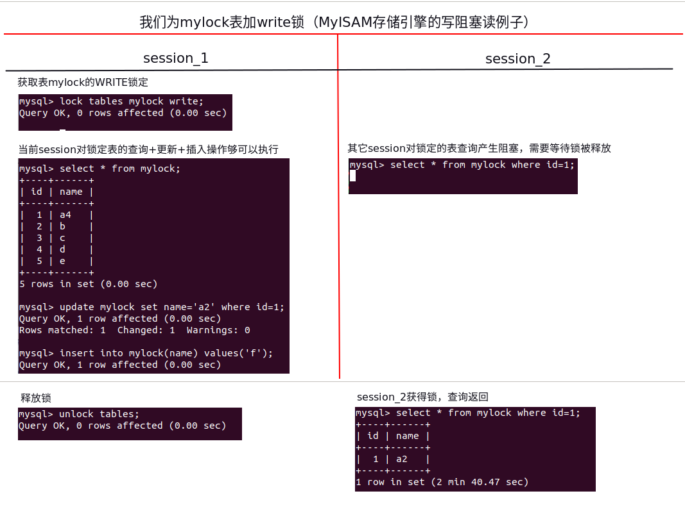

# [MySQL高级部分](https://www.bilibili.com/video/BV1KW411u7vy)

## [迪卡尔积原理](https://blog.csdn.net/u010931123/article/details/81667723)

## [MySQL底层架构原理，工作流程和存储引擎的数据结构讲解](https://blog.csdn.net/m0_38075425/article/details/82256315)

数据库（DataBase）是存放用户数据的地方，当用户访问、操作数据库中的数据时，需要数据库管理系统的帮助。数据管理系统的全称是DataBase Management System，简称DBMS。通常情况下我们会把数据库和数据库管理系统笼统的称为数据库，通常所说的数据库既包括存储用户数据的部分，也包括管理数据库的管理系统。

MySQL是一种关系数据库管理系统，关系数据库将数据保存在不同的表中，而不是将所有数据放在一个大仓库内，这样就增加了速度并提高了灵活性。在 WEB 应用方面，MySQL是最好的 RDBMS (Relational Database Management System，关系数据库管理系统) 应用软件。MySQL使用 C和 C++编写，其体积小、速度快、源码开放，如今被应用在大量的中小型应用上。

1. MySQL架构图


1）连接层

     最上层的连接池是一些连接服务，包含本地sock通信和大多数基于C/S工具实现的类似于TCP/IP的通信。主要完成一些类似于连接处理、授权认证及相关的安全方案。在该层上引入了线程池的概念，为通过认证安全接入的客户端提供线程。同样在该层上可以实现基于SSL的安全连接。服务器也会为安全接入的每个客户端验证它所具有的操作权限。

2）服务层

     第二层架构主要完成大多数的核心服务功能，如SQL接口、缓存的查询、SQL的分析和优化、内置函数等。所有跨存储引擎的功能也在这一层实现，如过程、函数等。在该层，服务器会解析查询并创建相应的内部解析树，并对其完成相应的优化如确定查询表的顺序，是否利用索引等，最后生成相应的执行操作。如果是select语句，服务器还会查询内部的缓存，如果缓存空间足够大，这样在频繁读操作的环境中能够很好的提升系统的性能。

3）引擎层

     存储引擎真正的负责MySQL中数据的存储和提取，服务器通过API与存储引擎进行通信，不同的存储引擎具有的特性不同，我们可以根据实际需进行选取。下文将对相关存储引擎进行具体介绍。

4）存储层

     数据存储层，主要是将数据存储在运行于裸设备的文件系统之上，并完成与存储引擎的交互。

SQL的执行过程：

     数据库通常不会被单独使用，而是由其它编程语言通过SQL支持接口调用MySQL，由MySQL处理并返回执行结果。首先，其它编程语言通过SQL支持接口调用MySQL，MySQL收到请求后，会将该请求暂时放在连接池，并由管理服务与工具进行管理。当该请求从等待队列进入到处理队列时，管理器会将该请求传给SQL接口，SQL接口接收到请求后，它会将请求进行hash处理并与缓存中的数据进行对比，如果匹配则通过缓存直接返回处理结果；否则，去文件系统查询：由SQL接口传给后面的解析器，解析器会判断SQL语句是否正确，若正确则将其转化为数据结构。解析器处理完毕后，便将处理后的请求传给优化器控制器，它会产生多种执行计划，最终数据库会选择最优的方案去执行。确定最优执行计划后，SQL语句交由存储引擎处理，存储引擎将会到文件系统中取得相应的数据，并原路返回。

2. MySQL的存储引擎

1）MyISAM存储引擎

     MyIsam 的存储文件有三个，后缀名分别是 .frm、.MYD、MYI，其中 .frm 是表的定义文件，.MYD 是数据文件，.MYI 是索引文件。MyIsam 只支持表锁，不支持事务。MyIsam 由于有单独的索引文件，在读取数据方面的性能很高。Myisam是以堆结构进行组织数据，其表容易损坏。

2）InnoDB

     InnoDB 的存储文件有两个，后缀名分别是 .frm 和 .idb，其中 .frm 是表的定义文件，而 idb 是数据文件。InnoDB 中存在表锁和行锁，不过行锁是在命中索引的情况下才会起作用。InnoDB 支持事务，且支持四种隔离级别（读未提交、读已提交、可重复读、串行化），默认的为可重复读。

3）两大存储引擎的数据结构

     MyISAM和InnoDB两种存储引擎都采用了B+树（有关B+树的概念和由来，请见笔者相关博客）的数据结构，但具体实现方式完全不同。

     MyISAM的B+树实现示例图：
     

     MyISAM的B+树叶子节点存储的并不是数据，而是数据地址，因此也称为非聚集索引，搜索按照B+树的搜索算法进行。

     InnnDB的B+树实现示例图：
     

     InnoDB的B+树叶子节点存储的数据本身，以此也被成为聚集索引。从实现数据结构可知，如采用InnoDB存储引擎，不宜设置过长的主键(参考[数据库，主键为何不宜太长长长长长长长长？（转）](https://www.cnblogs.com/chenlinlab/p/11609851.html))。
     另外，使用InnoDB尽量采用自增(或自减)的数据作为主键，否则会造成频繁B+的分裂合并调整。
     从数据库结构的实现看出，当读写更新比较频繁，读写要求一致性比较高的业务，采用InnoDB更佳。
     
[DB——数据的读取和存储方式](https://my.oschina.net/u/1859679/blog/1581379)   


注：B+树的每一个节点都存储n倍个page(4k)。    
    

    
    
## 索引
索引就是排好序的快速查找数据结构：<where_condition>(查找) <oder by_field>(排序)

在数据之外，数据库系统还维护着满足特定查找算法的数据结构，这些数据结构以某种方式指向数据，
这样就可以在这些数据结构的基础上实现高级查找算法，这种数据结构就是索引。
    
-   Explain
    -   用法：
        explain + SQL    
    -   能干嘛？
        -   表的读取顺序
        -   数据读取操作的操作类型    
        -   哪些索引可以使用
        -   哪些索引被实际使用
        -   表之间的引用
        -   每张表有多少行被优化器查询
        
    -   explain 显示的表头列分析
        -   id(id相同时，自上而下顺序执行，id不同时，从大到小执行)
        -   select_type(select类型): simple|primary|derived(派生[虚表])|union|union result(联合查询结果)   
        -   type(联接类型): system > const > eq_ref > ref > range > index > ALL
        -   possible_keys(理论选择的索引)
        -   key(实际已使用的索引、理论上不用索引实际可用索引，理论上用索引实际不用索引)
        -   key_len
        -   ref(与索引比较的列有哪些)
        -   extra(额外重要的那些)：filesort、using temporary、using index、

    -   索引优化案例
        -   单表分析
            ```sql
            create table IF NOT EXISTS article (
            id int(10) unsigned not null primary key auto_increment,
            author_id int(10) unsigned not null,
            category_id int(10) unsigned not null,
            views int(10) unsigned not null,
            comments int(1) unsigned not null,
            title varbinary(255) not null,
            content text not null
            );
            
            insert into artile(author_id, category_id, view, comments, title, content)
            values (1,1,1,1,'1','1'),
            (2,2,2,2,'2','2'),
            (1,1,3,3,'3','3');
            ```
            查询 category_id 为 1 且 comments 大于 1 的情况下，views 最多 article_id.
            
            select article_id from article where category_id=1 and comments > 1 order by views desc limit 1;

            

            针对以上问题，创建索引如下：
            
            ```sql
            create index idx_article_ccv on article(category_id, comments, views);
            ```
            
            
            
            经explain分析，依然存在内部排序(filesort)的问题！
            
            解决：删除原来创建的索引，再创建如下：
            
            ```sql
            drop index idx_article_ccv on article;
            create index idx_article_cv on article(category_id, views);
            ```
            
            
        -   两表分析    
            ```sql
            create table if not exists class (
                id int(10) unsigned not null auto_increment,
                card int(10) unsigned not null,
                primary key(id)
            );
            
            create table if not exists book(
                bookid int(10) unsigned not null auto_increment,
                card int(10) unsigned not null,
                primary key(bookid)
            );
            
            INSERT INTO class(card) VALUES(FLOOR(1 + (RAND() * 20)));
            INSERT INTO class(card) VALUES(FLOOR(1 + (RAND() * 20)));
            INSERT INTO class(card) VALUES(FLOOR(1 + (RAND() * 20)));
            INSERT INTO class(card) VALUES(FLOOR(1 + (RAND() * 20)));
            INSERT INTO class(card) VALUES(FLOOR(1 + (RAND() * 20)));
            INSERT INTO class(card) VALUES(FLOOR(1 + (RAND() * 20)));
            INSERT INTO class(card) VALUES(FLOOR(1 + (RAND() * 20)));
            INSERT INTO class(card) VALUES(FLOOR(1 + (RAND() * 20)));
            INSERT INTO class(card) VALUES(FLOOR(1 + (RAND() * 20)));
            INSERT INTO class(card) VALUES(FLOOR(1 + (RAND() * 20)));
            INSERT INTO class(card) VALUES(FLOOR(1 + (RAND() * 20)));
            INSERT INTO class(card) VALUES(FLOOR(1 + (RAND() * 20)));
            INSERT INTO class(card) VALUES(FLOOR(1 + (RAND() * 20)));
            INSERT INTO class(card) VALUES(FLOOR(1 + (RAND() * 20)));
            INSERT INTO class(card) VALUES(FLOOR(1 + (RAND() * 20)));
            INSERT INTO class(card) VALUES(FLOOR(1 + (RAND() * 20)));
            INSERT INTO class(card) VALUES(FLOOR(1 + (RAND() * 20)));
            INSERT INTO class(card) VALUES(FLOOR(1 + (RAND() * 20)));
            INSERT INTO class(card) VALUES(FLOOR(1 + (RAND() * 20)));
            INSERT INTO class(card) VALUES(FLOOR(1 + (RAND() * 20)));
            INSERT INTO book(card) VALUES(FLOOR(1 + (RAND() * 20)));
            
            
            INSERT INTO book(card) VALUES(FLOOR(1 + (RAND() * 20)));
            INSERT INTO book(card) VALUES(FLOOR(1 + (RAND() * 20)));
            INSERT INTO book(card) VALUES(FLOOR(1 + (RAND() * 20)));
            INSERT INTO book(card) VALUES(FLOOR(1 + (RAND() * 20)));
            INSERT INTO book(card) VALUES(FLOOR(1 + (RAND() * 20)));
            INSERT INTO book(card) VALUES(FLOOR(1 + (RAND() * 20)));
            INSERT INTO book(card) VALUES(FLOOR(1 + (RAND() * 20)));
            INSERT INTO book(card) VALUES(FLOOR(1 + (RAND() * 20)));
            INSERT INTO book(card) VALUES(FLOOR(1 + (RAND() * 20)));
            INSERT INTO book(card) VALUES(FLOOR(1 + (RAND() * 20)));
            INSERT INTO book(card) VALUES(FLOOR(1 + (RAND() * 20)));
            INSERT INTO book(card) VALUES(FLOOR(1 + (RAND() * 20)));
            INSERT INTO book(card) VALUES(FLOOR(1 + (RAND() * 20)));
            INSERT INTO book(card) VALUES(FLOOR(1 + (RAND() * 20)));
            INSERT INTO book(card) VALUES(FLOOR(1 + (RAND() * 20)));
            INSERT INTO book(card) VALUES(FLOOR(1 + (RAND() * 20)));
            INSERT INTO book(card) VALUES(FLOOR(1 + (RAND() * 20)));
            INSERT INTO book(card) VALUES(FLOOR(1 + (RAND() * 20)));
            INSERT INTO book(card) VALUES(FLOOR(1 + (RAND() * 20)));
            ```
            需求： class 左联接 book
            
            select * from class a left join book b on a.card = b.card;
            
            
           
            给左表class，字段card添加索引后结果如下：
            
            
            
            分析结果，虽然使用了索引,类型为index(全索引扫描),但需要检查的行数和没检索前相同。
            
            给右表book，字段card添加索引后结果如下：
            
            
            
            分析结果，使用的索引类型为ref(非唯一索引扫描)，而且检查的行数减少了，优化效率理想。
            
            **这些都是由左连接特性决定的，left join 条件用于确定如何从右表搜索行，左边一定都有，所以右边才是我们关键点，一定需要建立索引。**
            
        -   三表分析
            ```sql
            create table if not exists phone (
                phoneid int(10) unsigned not null auto_increment,
                card int(10) unsigned not null,
                primary key(phoneid)
            ) engine=InnoDB;
            
            
            insert into phone(card) values(floor(1+(rand()*20)));
            insert into phone(card) values(floor(1+(rand()*20)));
            insert into phone(card) values(floor(1+(rand()*20)));
            insert into phone(card) values(floor(1+(rand()*20)));
            insert into phone(card) values(floor(1+(rand()*20)));
            insert into phone(card) values(floor(1+(rand()*20)));
            insert into phone(card) values(floor(1+(rand()*20)));
            insert into phone(card) values(floor(1+(rand()*20)));
            insert into phone(card) values(floor(1+(rand()*20)));
            insert into phone(card) values(floor(1+(rand()*20)));
            insert into phone(card) values(floor(1+(rand()*20)));
            insert into phone(card) values(floor(1+(rand()*20)));
            insert into phone(card) values(floor(1+(rand()*20)));
            ```
            分析：class 左联接 book 左联接 phone 表 （建立索引情况同上）。
            
    -   **结论**  
        Join语句的优化：
        
        尽可能减少Join语句中的NestedLoop的循环总次数; "永远用小结果集驱动大的结果集"。
        
        优先优化NestedLoop的内层循环;
        
        保证Join语句中被驱动表上Join条件字段已经被索引;
        
        当无法保证被驱动表的Join条件字段被索引且内存资源充足的前提下，不要太吝啬JoinBuffer的设置;
        
    -   覆盖索引(Covering Index)，一文说索引覆盖
    
        就是select数据列只用从索引中就能取得，不必读取数据行，MySQL利用索引返回select列表中的字段，而不必根据索引再次读取数据文件，换句话说查询列要被所建的索引覆盖。

-   SQL优化
    -   准备SQL
        ```sql
            create table if not exists staffs(
            id int primary key auto_increment,
            name varchar(24) not null default '' comment '姓名',
            age int not null default 0 comment '年龄',
            pos varchar(20) not null default '' comment '职位',
            add_time timestamp not null default current_timestamp comment '入职时间'
            ) charset utf8 comment '员工记录表';
            
            insert into staffs(name, age, pos, add_time) values('z3',22,'manager', NOW());
            insert into staffs(name, age, pos, add_time) values('July',23,'dev', NOW());
            insert into staffs(name, age, pos, add_time) values('2000',23,'dev', NOW());
            
            select * from staffs;
            
            alter table staffs add index idx_staffs_nameAgePos(name, age, pos);
        ```     
    -   案例（索引失效）
        -   全值匹配我最爱
        -   最佳左前缀法则(带头大哥不能死，中间兄弟不能丢)

            如果索引了多列，遵守最左前缀法则，指的是查询从索引的最前列开始并且**不跳过索引中的树**。
            
            
            
            中间丢失后面字段索引失效：
            
            
        -   不在索引列上做任何操作(计算、函数、[自动or手动]类型转换)，会导致索引失效而转向全表扫描

                
        
        -   存储引擎不能使用索引中范围条件右边的列
        
            
        
        -   尽量使用覆盖索引(只访问索引的查询[索引列和查询列一致])，减少select *
        
            
        
        -   MySQL 在使用不等于(!= 或者 <>)的时候无法使用索引会导致全表扫描
        
            
        
        -   is null，is not null 也无法使用索引
        
            
        
        -   like 以通配符开头('%abc...')MySQL索引失效会变成全表扫描的操作
            ```sql
            create table tbl_user(
            id int(11) not null auto_increment,
            name varchar(20) default null,
            age int(11) default null,
            email varchar(20) default null,
            primary key(id)
            ) engine = innodb auto_increment=1 default charset=utf8;
            
            
            insert into tbl_user(name, age, email) values('aa1', 21, 'b@163.com');
            insert into tbl_user(name, age, email) values('aa2', 222, 'a@163.com');
            insert into tbl_user(name, age, email) values('aa3', 265, 'c@163.com');
            insert into tbl_user(name, age, email) values('aa4', 21, 'd@163.com');
            ```
            
            
        
            需求，必须使用"%%"来查询！！！
            
            没有添加索引前：
            
            
            
            添加索引后：
            alter table tbl_user add index idx_nameAge(name,age);
            ```sql
            explain select name,age from tbl_user where name like '%aa%';
            explain select id from tbl_user where name like '%aa%';
            explain select name from tbl_user where name like '%aa%';
            explain select age from tbl_user where name like '%aa%';
            
            explain select id,name from tbl_user where name like '%aa%';
            explain select id,name,age from tbl_user where name like '%aa%';
            explain select name,age from tbl_user where name like '%aa%';
            
            
            explain select * from tbl_user where name like '%aa%';
            explain select id,name,age,email from tbl_user where name like '%aa%';
            ```
            
            
            
        -   字符串不加单引号索引失效
            
            
            
        -   少用or，用它来连接时会索引失效
        -   小结：
        
            全职匹配我最爱,最左前缀要遵守;
            
            带头大哥不能死,中间兄弟不能断;
            
            索引列上少计算,范围之后全失效;
            
            LIKE 百分写最右,覆盖索引不写*;
            
            不等空值还有 OR,索引影响要注意;
            
            VAR 引号不可丢,SQL 优化有诀窍。
        -   练习
            ```sql
            create table test03(
            id int primary key not null auto_increment,
            c1 char(10),
            c2 char(10),
            c3 char(10),
            c4 char(10),
            c5 char(10)
            );
            
            insert into test03(c1,c2,c3,c4,c5) values('a1','a2','a3','a4','a5');
            insert into test03(c1,c2,c3,c4,c5) values('b1','b2','b3','b4','b5');
            insert into test03(c1,c2,c3,c4,c5) values('c1','c2','c3','c4','c5');
            insert into test03(c1,c2,c3,c4,c5) values('d1','d2','d3','d4','d5');
            insert into test03(c1,c2,c3,c4,c5) values('e1','e2','e3','e4','e5');
            
            select * from test03;
            
            [创建索引]
            create index idx_test03_c1234 on test03(c1,c2,c3,c4);
            show index from test03;
            
            问题：我们创建了复合索引idx_test03_c1234，根据以下SQL分析下索引使用情况？
            
            explain select * from test03 where c1='a1';
            explain select * from test03 where c1='a1' and c2='a2';
            explain select * from test03 where c1='a1' and c2='a2' and c3='a3';
            explain select * from test03 where c1='a1' and c2='a2' and c3='a3' and c4='a4';
            
            1)
            explain select * from test03 where c1='a1' and c2='a2' and c3='a3' and c4='a4';
            2)
            explain select * from test03 where c1='a1' and c2='a2' and c4='a4' and c3='a3';
            3)
            explain select * from test03 where c1='a1' and c2='a2' and c3>'a3' and c4='a4';
            4)
            explain select * from test03 where c1='a1' and c2='a2' and c4>'a4' and c3='a3';
            5)
            explain select * from test03 where c1='a1' and c2='a2' and c4='a4' order by c3;
            c3作用在于排序而不是查找
            6)
            explain select * from test03 where c1='a1' and c2='a2' order by c3;
            7)
            explain select * from test03 where c1='a1' and c2='a2' order by c4;
            c4产生filesort
            8)
            8.1)
            explain select * from test03 where c1='a1' and c5='a5' order by c2,c3;
            只用了c1一个字段索引，但是c2,c3仅用于排序，无filesort
            8.2)
            explain select * from test03 where c1='a1' and c5='a5' order by c3,c2;
            只用了c1一个字段索引，有filesort
            9)
            explain select * from test03 where c1='a1' and c2='a2' order by c2,c3;
            10)
            explain select * from test03 where c1='a1' and c2='a2' and c5='a5' order by c2,c3;
            用c1、c2两个字段索引，但是c2、c3用于排序，无filesort
            11)
            explain select * from test03 where c1='a1' and c2='a2' and c5='a5' order by c3,c2;
            本例有常理c2的情况，对比8.2
            12)
            explain select * from test03 where c1='a1' and c5='a5' order by c3,c2;
            只用了c1一个字段索引，且产生filesort
            13)
            explain select * from test03 where c1='a1' and c4='a4' group by c2,c3;
            只用了c1一个字段索引
            explain select * from test03 where c1='a1' and c4='a4' group by c3,c2;
            只用了c1一个字段索引，且产生了temporary和filesort
            ```
        -   小结论
            
            在索引分析时，定值是常量，范围后索引会失效，一般order by是给定范围的;
            group by 基本上都需要排序，会有临时表产生;
               
-   SQL优化分析总结
    1. 慢查询的开启并捕获
    2. explain+慢SQL分析
    3. show profile 查询SQL在MySQL服务器里面的执行细节和生命周期情况
    4. SQL数据服务器的参数调优 
       
    -   带in 或 exists 语句的优化
        -   小表驱动大表原则
            
        -   EXISTS 用法
            
    -   order by 语句的优化
        
        提高order by速度：
        

        为排序使用索引：
        
        
        单路排序和双路排序（调参数：sort_buffer_size、max_length_for_sort_data）
        
    -   group by 语句的优化
        
        group by 实质是先排序后分组，遵守索引的最左前缀法则，其他跟order by 优化规则一样，
        where高于having，能写在where限定后的条件，尽量不要去having限定;
       
-   show profile
    -   是什么？
        是MySQL提供可以用来分析当前会话中语句执行的资源消耗情况。可以用于SQL优化的测量。
        
        默认情况下，参数处于关闭状态，并保存最近15次的运行结果。
        
    -   官网
        http://dev.mysql.com/doc/refman/5.7/en/show-profile.html            
    
    -   分析步骤
        -   是否支持，看看当前的MySQL版本是否支持
        -   开启功能，默认是关闭，使用前需要开启
        -   运行SQL
        -   查看结果，show profiles;
        
            
        
        -   诊断SQL，show profile cpu,block io for query 上一步前面的问题SQL数字号码;
        
            
        
        -   日常开发需要注意的结论    
            1) converting HEAP to ondisk 查询结果太大，内存都不够用了往磁盘上搬了。
            2) Creating tmp table 创建临时表
            3) Copying to tmp table on disk 把内存中临时表复制到磁盘，危险！！！
            4) locked
        
-   全局查询日志(==永远不要在生产环境开启==)
    -   启用（配置启用和编码启用）
        ```sql
        set global general_log = 1;
        set global log_output='TABLE';
        ```
    -   查看
        ```sql
        mysql> select * from mysql.general_log;
        +----------------------------+---------------------------+-----------+-----------+--------------+----------------------------------------------+
        | event_time                 | user_host                 | thread_id | server_id | command_type | argument                                     |
        +----------------------------+---------------------------+-----------+-----------+--------------+----------------------------------------------+
        | 2020-03-28 14:12:32.066357 | root[root] @ localhost [] |        11 |         0 | Query        | select * from emp group by deptno asc, empno |
        | 2020-03-28 14:13:07.132625 | root[root] @ localhost [] |        11 |         0 | Query        | select * from general_log                    |
        | 2020-03-28 14:13:12.082828 | root[root] @ localhost [] |        11 |         0 | Query        | select * from mysql.general_log              |
        +----------------------------+---------------------------+-----------+-----------+--------------+----------------------------------------------+
        3 rows in set (0.00 sec)
        ```
        
 ## MySQL锁机制
 -  锁概念
    
    锁是计算机协调多个进程或线程并发访问某一资源的机制。
    
    在数据库中，除传统的计算资源（如CPU、RAM、IO等）的争抢以外，数据也是供许多用户共享的资源。如何保证数据并发访问的一致性、有效性是所有数据库必须解决的一个问题。
    
    锁冲突也是影响数据库并发访问性能的一个重要因素。从这个角度来说，锁对数据库而言显得尤其重要，也更加复杂。
    
 -  锁分类
    -   从对数据操作类型分（读/写）
        -   读锁（共享锁）：针对同一份数据，多个读操作可以同时进行而不会互相影响
        -   写锁（排它锁）：当前写操作没有完成之前，它会阻断其它写锁和读锁
    -   从对数据操作的粒度分（表锁/行锁）   
        -   表锁
            1. 特点
        -   行锁
            1. 特点：偏向于InnoDB引擎，开销大，加锁慢，会出现死锁，锁定粒度最小，发生锁冲突的概率最低，并发度也最高
            2. 老知识(行锁支持事务)：
            
               1）、事务(Transaction)以及ACID属性;

               2）、并发事务处理带来的问题：更新丢失、脏读、不可重复读、幻读
               
               3）、事务的隔离级别(用于解决数据库读一致性问题)
               
                    
 -  表锁应用分析
    -   MySQL(MySQLISAM)
        ```sql
        --# [表级锁分析--建立SQL]
        
        create table mylock(
        id int not null primary key auto_increment,
        name varchar(20)
        ) engine myisam;
        
        insert into mylock(name) values('a');
        insert into mylock(name) values('b');
        insert into mylock(name) values('c');
        insert into mylock(name) values('d');
        insert into mylock(name) values('e');
        
        select * from mylock;
        ```
        1. 加读锁
              
    
        2. 加写锁
           
    
        3. 结论
           
    
        4. MySQLISAM表锁分析
           

        5. 表锁建议
                        
            
 -  行锁应用分析   
    -   MySQL(INNODB)
        ```sql
        -- #[行级锁分析--建立SQL]
        
        create table test_innodb_lock (a int(11),b varchar(16)) engine=innodb;
        
        insert into test_innodb_lock(a,b) values(1,'b2');
        insert into test_innodb_lock(a,b) values(3,'3');
        insert into test_innodb_lock(a,b) values(4,'4000');
        insert into test_innodb_lock(a,b) values(5,'5000');
        insert into test_innodb_lock(a,b) values(6,'6000');
        insert into test_innodb_lock(a,b) values(7,'7000');
        insert into test_innodb_lock(a,b) values(8,'8000');
        insert into test_innodb_lock(a,b) values(9,'9000');
        insert into test_innodb_lock(a,b) values(1,'b1');
        
        create index test_innodb_a_ind on test_innodb_lock(a);
        
        create index test_innodb_lock_b_ind on test_innodb_lock(b);
        
        select * from test_innodb_lock;
        ```
        1. 行锁基本演示
        
        2. 无索引行锁升级为表锁
           
    
        3. 间隙锁危害
           
        
        4. 锁定行[排它锁](for update[阻塞其它事务] / for update nowait[拒绝其它事务])
           

        5. 行锁分析(INNODB)
           
           
        6. 行锁建议(INNODB)
              
        
        
## MySQL主从复制
-   主从复制的步骤
            
    


## 跟页有关的参考：    
-   [Linux 的内存分页管理](https://cloud.tencent.com/developer/article/1463274)     
-   [分页机制图文详解](https://www.jianshu.com/p/3558942fe14f)     

## 跟锁有关的参考
-   [详解mysql的for update](https://blog.csdn.net/xiao__jia__jia/article/details/100901858)