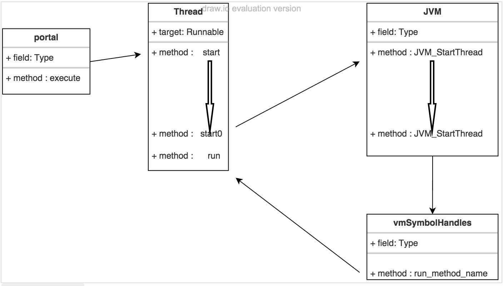

##  一、线程

### 1、基本概念

#### 1.1、线程、进程

线程，一个程序内部的顺序控制流;

进程，一个exe文件，一个class文件;

#### 1.2、线程和进程的区别

- 每个进程都有独立的代码和数据空间(进程上下文)，进程间切换会有很大开销;
- 线程可以看成是轻量级的进程，同一类线程共享代码和数据空间，每个线程有独立的运行栈和程序技术器(PC)，线程切换开销小;
- 多进程，在操作系统中能同时运行多个任务(程序);
- 多线程，在同一应用程序中有多个顺序流同时执行;

==Java的线程是通过java.lang.Thread类来实现;==

JVM启动时会有一个由主方法（public static void main(){}）所定义的线程;

可以通过创建Thread实例来创建新的线程;

每个线程都是通过某个特定Thread对象所对应的方法run()来完成其操作的，方法run()成为线程体;

### 1.3、线程池

​	1.3.1、线程池以及实现？

​	

### 1.4、线程锁

​	1.4.1、锁的种类有哪些？	

​		A、可重入锁：synchronized、reentrantLock

​		B、互斥锁

​		C、乐观锁/悲观锁

​		D、公平锁/非公平锁

​		E、类锁/对象锁

​		F、自旋锁

​		G、阻塞锁

​		H、读写锁

​		I、独享锁

​		J、共享锁

​		K、偏向锁

​		L、分段锁

#### 2、线程的创建和启动

可以有三种种方式创建新的线程;

线程类Thread，也实现了Runnable接口，或者Callable接口;

- 定义线程类实现Runnable接口，Runnable接口只有一个方法run;
- 定义一个Thread的子类并重写run方法;

**无论是实现Runnable接口还是继承Thread类，最终线程的开始都是通过调用Thread类的start()方法来启动一个线程;**

[参考地址1](https://www.linuxidc.com/Linux/2016-03/128997.htm)
[参考地址2](https://blog.csdn.net/qq_35542218/article/details/86767610)

**run方法一结束线程就结束;**

#### 3、线程状态转换


#### 4、线程控制方法


#### 5、Thread类，sleep/join/yield方法

- sleep方法
  - Thread类的静态方法，表示使得当前线程休眠（暂时停止执行mills毫秒）
  - Thread.sleep(...)在哪个线程下执行，就休眠哪个线程;
- join方法
  - 合并某个线程（变成方法调用）
- yield方法
  - 让出CPU，给其他线程执行的机会

#### 6、线程的优先级

java提供一个线程调度器来监控程序中启动后进入就绪状态的所有线程。

线程调度器按照线程的优先级决定应调度哪个线程来执行;

线程优先级是数字表示，从1～10，默认是5;

#### 7、 线程同步

实例，**取款**

两个线程在执行一个方法（**取款**）的过程中，两个线程同时访问同一个资源（**银行账户**），如果线程来回之间协调不好的，很容易出现数据前后不一致;

==我们把线程访问同一个份资源的多个线程之间来进行协调的东西叫线程同步;==

**互斥锁，synchronized**

**死锁**，实例	

**生产者消费者模型**

wait(Object)，当前的正在我这个对象访问的线程wait;

wait会让线程释放锁，跟synchronized共同使用;

sleep，睡着了也要抱着那把锁;

notify();叫醒一个现在正在wait在我这个对象的线程;


# 二、集合

Java集合框架图


Collection类图


## 1、Collection


## 2、ArrayList

```java
public class ArrayList<E> extends AbstractList<E>
        implements List<E>, RandomAccess, Cloneable, java.io.Serializable
{
	private int size; // 数组所包含元素个数
	transient Object[] elementData; // ArrayList元素存储缓存区
	
```


# 三、缓存

## 1、Redis缓存

#### 1.1、redis缓存穿透

> 是指查询一个一定不存在的数据，由于缓存是不命中时需要从数据库查询，查不到数据就不写入缓存，这将导致这个不存在的数据每次请求都要到数据库去查询，造成缓存穿透;

##### 解决办法

​	1）**布隆过滤**;

​		在控制曾进行校验，不符合则丢弃，从而避免对底层存储系统的查询压力;

​	2）**缓存空对象. 将 null 变成一个值**;

​		如果查询返回的数据为空（真实不存在或者系统故障），将空短时间缓存起来;

#### 1.2、redis缓存雪崩

> 如果缓存集中到一段时间内失效，发生大量的缓存穿透，所有的查询都落到数据库中，造成缓存雪崩;

##### 解决办法

​	1）加锁排队、限流算法

​		在缓存失效后，通过加锁或者队列来控制读数据库写缓存的线程数量;

​	2）数据预热

​		可以通过缓存reload机制，预先去更新缓存，再即将发生大并发访问前手动触发缓存不同的key，设置不同的过期时间，让缓存失效的时间点尽量均匀;

​	3）做二级缓存或者双缓存

​		A1为原始缓存，A2为拷贝缓存，A1失效时，可以访问A2，A1缓存失效时间设置为短期，A2设置为长期;

​	4）缓存永不过期

​		