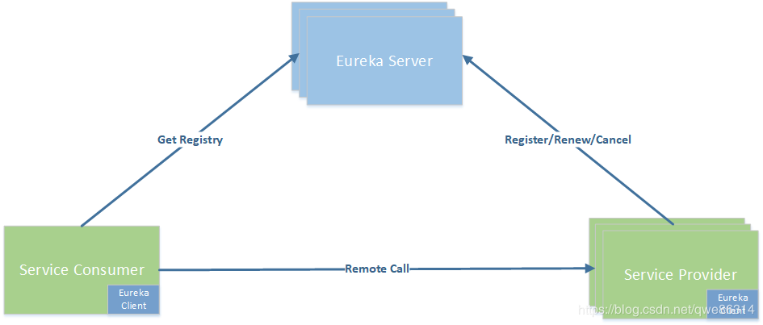
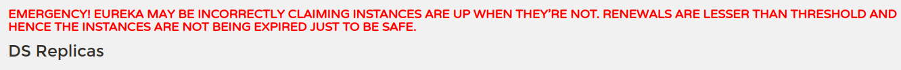

## CAP理论
....

## Eureka 作为服务注册中心应用 
### 集群原理

-   互相注册，互相守望
    -   eureka 之间相互注册
    -   服务提供方和服务消费方要全部注册到eureka集群中
-   多个服务注册中心
-   多个服务提供方
-   服务消费方，不用关注服务地址和端口号（HttpClient/RestTemplate），只需要知道微服务名称，而且微服务具有负载均衡能力。    

### eureka常见设置
-   服务名修改和IP地址可见设置
    ```yaml
        eureka:  
          instance:
            instance-id: payment7002
              # 显示服务对应的IP地址
              prefer-ip-address: true
    ```           
    
-   actuator服务信息完善
    -   spring-boot-starter-actuator 提供服务监控和管理
    -   spring-boot-starter-web 提供web功能
    
### 服务发现Discovery
-   Bean：DiscoveryClient   
-   注解：@EnableDiscoveryClient

### eureka自我保护机制
-   自我保护机制  
     
    eureka 服务端在一定时间内（默认是90秒）没有收到eureka客户端发来的心跳时，就会直接从服务列表中剔除该服务，短时间内丢失服务实例心跳，这时eureka就会启用自我保护机制，不会剔除该服务。
-   设计哲学    
    宁可保留错误的服务注册信息，也不盲目地注销任何可能健康的服务
-   禁用自我保护机制
      
    ```yaml
      eureka:  
        server:
          # 禁用自我保护机制，保证服务被及时删除
          enable-self-preservation: false
          # 清理无效节点时间间隔，单位毫秒（默认60秒）
          eviction-interval-timer-in-ms: 2000
    ```
    
### Eureka控制台参数说明
1、 HOME
   进入Eureka控制台首页，首先看HOME页的头部

-   System Status
    -   Environment: 环境，默认为test，该参数在实际使用过程中，可以不用更改
    -   Data center： 数据中心，使用的是默认的是 "defualt"
    -   Current time：当前的系统时间
    -   Uptime：已经运行了多少时间
    -   Lease expiration enabled：是否启用租约过期 ，自我保护机制关闭时，该值默认是true， 自我保护机制开启之后为false。
    -   Renews threshold： 每分钟最少续约数，Eureka Server 期望每分钟收到客户端实例续约的总数。
    -   Renews (last min)： 最后一分钟的续约数量（不含当前，1分钟更新一次），Eureka Server 最后 1 分钟收到客户端实例续约的总数。

2、红字提醒
    系统在三种情况下会出现红色加粗的字体提示：
-   a.在配置上，自我保护机制关闭       
    
    RENEWALS ARE LESSER THAN THE THRESHOLD. 
    THE SELF PRESERVATION MODE IS TURNED OFF.THIS MAY NOT PROTECT INSTANCE EXPIRY IN CASE OF NETWORK/OTHER PROBLEMS.

-   b.自我保护机制开启了 
        
    EMERGENCY! EUREKA MAY BE INCORRECTLY CLAIMING INSTANCES ARE UP WHEN THEY'RE NOT. 
    RENEWALS ARE LESSER THAN THRESHOLD AND HENCE THE INSTANCES ARE NOT BEING EXPIRED JUST TO BE SAFE.

-   c.在配置上，自我保护机制关闭了，但是一分钟内的续约数没有达到85% ， 可能发生了网络分区，会有如下提示   
    
    THE SELF PRESERVATION MODE IS TURNED OFF.THIS MAY NOT PROTECT INSTANCE EXPIRY IN CASE OF NETWORK/OTHER PROBLEMS.

3、DS Replicas
这个下面的信息是这个Eureka Server相邻节点，互为一个集群。

再往下面，就是注册到这个服务上的实例信息，这个就不多讲了，大家都知道。

4、General Info
-   total-avail-memory : 总共可用的内存
-   environment : 环境名称，默认test
-   num-of-cpus : CPU的个数
-   current-memory-usage : 当前已经使用内存的百分比
-   server-uptime : 服务启动时间
-   registered-replicas : 相邻集群复制节点
-   unavailable-replicas ：不可用的集群复制节点，如何确定不可用？ 主要是server1 向 server2和server3发送接口查询自身的注册信息，
如果查询不到，则默认为不可用，也就是说如果Eureka Server自身不作为客户端注册到上面去，则相邻节点都会显示为不可用。
-   available-replicas ：可用的相邻集群复制节点

5、Instance Info
-   ipAddr：eureka服务端IP
-   status：eureka服务端状态

## zookeeper 作为服务注册中心应用

-   注册中心配置
    ```yaml
     spring:  
       cloud:
         zookeeper:
           connect-string: 172.17.0.2:2181
    ```
       
-   @EnableDiscoveryClient 注解为zookeeper或这consul作为注册中心注册服务使用

-   启动后zookeeper客户端znode节点信息   
```text
[zk: localhost:2181(CONNECTED) 4] get /services/cloud-payment-server/3792a991-575a-4890-b856-ecfcaf1c6b44
{
  "name": "cloud-payment-server",
  "id": "3792a991-575a-4890-b856-ecfcaf1c6b44",
  "address": "aspire.lan",
  "port": 8004,
  "sslPort": null,
  "payload": {
    "@class": "org.springframework.cloud.zookeeper.discovery.ZookeeperInstance",
    "id": "application-1",
    "name": "cloud-payment-server",
    "metadata": {}
  },
  "registrationTimeUTC": 1584373887265,
  "serviceType": "DYNAMIC",
  "uriSpec": {
    "parts": [
      {
        "value": "scheme",
        "variable": true
      },
      {
        "value": "://",
        "variable": false
      },
      {
        "value": "address",
        "variable": true
      },
      {
        "value": ":",
        "variable": false
      },
      {
        "value": "port",
        "variable": true
      }
    ]
  }
}
```
-   注意
    -   存储为临时节点，当服务停止后会立即移除


参考列表:     
  - [Eureka工作原理](https://blog.csdn.net/qwe86314/article/details/94552801)