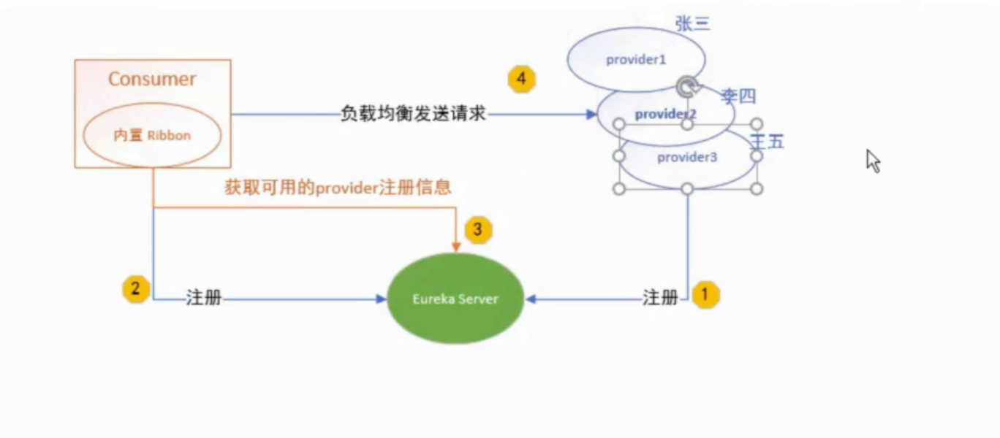

# 负载均衡（LB）
-   是什么？    
    将用户的请求凭摊的分配到多个服务器上，从而达到系统的HA（高可用）

-   分类
    -   集中式LB   
        即在服务的消费方和提供方之间使用独立的LB设置（可以是硬件，如F5，也可以是软件，如nginx），由该设施负责把访问请求通过某种策略转发到服务的提供方;
        
    -   进程内LB   
        将LB逻辑集成到消费方，消费方从服务注册中心获知有哪些地址可用，然后自己再从这些地址中选择出一个合适的服务器。
        Ribbon就属于进程内LB，它只是一个类库，集成于消费方进程，消费方通过它获取到服务提供方的地址。
    
-   常见的负载均衡
    Nginx、LVS、硬件、F5等
        
-   Ribbon = 本地负载均衡客户端 + RestTemplate（利用RestTemplate对http请求的封装处理，形成模板化的调用方法）
    -   原理  
        
    -   使用方法 在配置类配置 RestTemplate 方法上放置 @LoadBalanced 注解

-   OpenFeign/Feign 声明式 web service 客户端，内部集成 Ribbon
    -   依赖包
        ```xml
        <dependency>
            <groupId>org.springframework.cloud</groupId>
            <artifactId>spring-cloud-starter-openfeign</artifactId>
        </dependency>
        ``` 
    -   实际使用
        -   主启动类上添加注解：@EnableFeignClients    
        -   消费方接口：添加注解：@FeignClient(value="微服务名称")
        
        