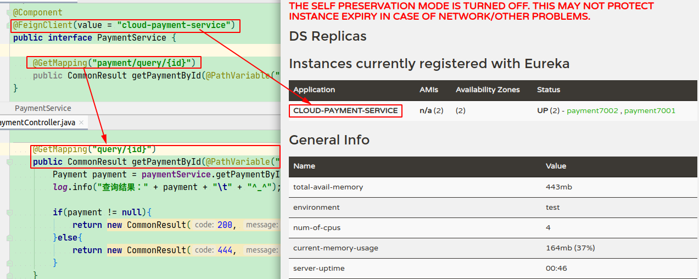
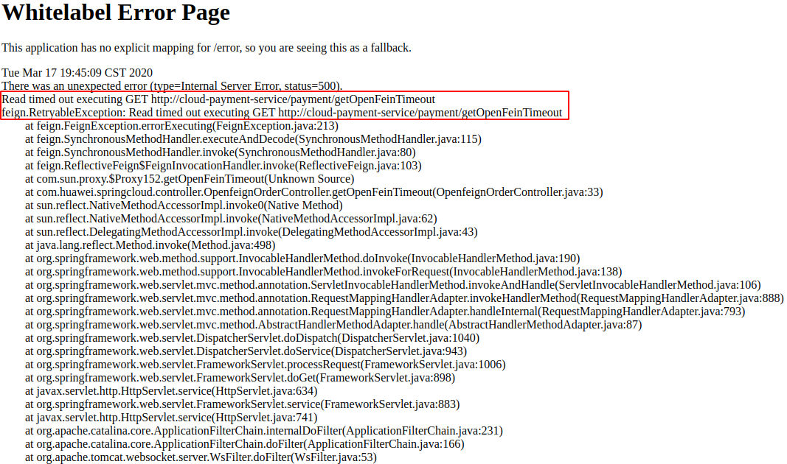
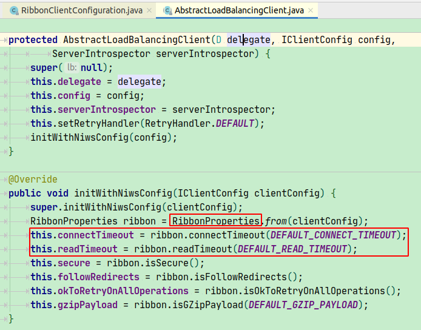

# 负载均衡（LB）
-   是什么？    
    将用户的请求凭摊的分配到多个服务器上，从而达到系统的HA（高可用）

-   分类
    -   集中式LB   
        即在服务的消费方和提供方之间使用独立的LB设置（可以是硬件，如F5，也可以是软件，如nginx），由该设施负责把访问请求通过某种策略转发到服务的提供方;
        
    -   进程内LB   
        将LB逻辑集成到消费方，消费方从服务注册中心获知有哪些地址可用，然后自己再从这些地址中选择出一个合适的服务器。
        Ribbon就属于进程内LB，它只是一个类库，集成于消费方进程，消费方通过它获取到服务提供方的地址。
    
-   常见的负载均衡
    Nginx、LVS、硬件、F5等
        
-   Ribbon = 本地负载均衡客户端 + RestTemplate（利用RestTemplate对http请求的封装处理，形成模板化的调用方法）
    -   原理  
        
    -   使用方法 在配置类配置 RestTemplate 方法上放置 @LoadBalanced 注解

-   OpenFeign/Feign 声明式 web service 客户端，内部集成 Ribbon
    -   依赖包
        ```xml
        <dependency>
            <groupId>org.springframework.cloud</groupId>
            <artifactId>spring-cloud-starter-openfeign</artifactId>
        </dependency>
        ``` 
    -   实际使用（微服务调用接口+@FeignClient）
        -   主启动类上添加注解：@EnableFeignClients    
        -   消费方接口：添加注解：@FeignClient(value="微服务名称")
        
    -   调用方法
           
    
    -   超时控制
        OpenFeign默认等待接口响应时间默认为1秒
        -   超时异常消息
             

        -   由于OpenFeign集成了Ribbon，只需设置Ribbon响应超时时间即可
            
            
            ```yaml
            # openfeign 超时时间设置
            ribbon:
              # 指建立连接所用时间，使用于网络状况正常的情况下，两端连接所用的时间
              ReadTimeout: 5000
              # 指建立连接后从服务器读取可用资源所用的时间
              ConnectTimeout: 5000
            ``` 
    -   日志打印功能
        -   日志打印级别
            NONE：默认的，不显示任何日志
            BASIC：仅记录请求方法、URL、响应状态码及执行时间
            HEADERS：除了BASIC中定义的信息之外，还有请求和响应的头信息
            FULL：除了HEADERS中定义的信息之外，还有请求和响应的正文以及元数据
        -   配置日志打印
            1. 添加OpenFeign日志打印级别的配置类Bean
               ```java
               @Configuration
               public class FeignConfig {
                   @Bean
                   Logger.Level feignLoggerLevel(){
                       return Logger.Level.FULL;
                   }
               }    
               ```
            2. 在yaml文件中设置springboot日志打印级别
               ```yaml
               # 使用root级别和package级别来控制日志的输入级别
               logging:
                 level:
                   com.huawei.springcloud.service.PaymentService: debug
               ```
               
                    