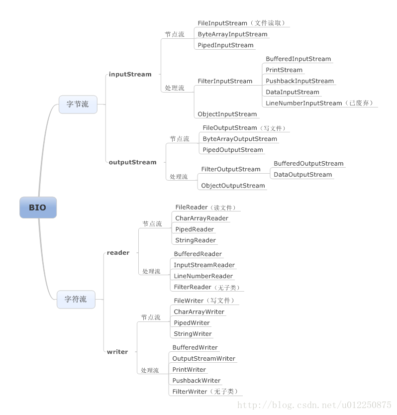
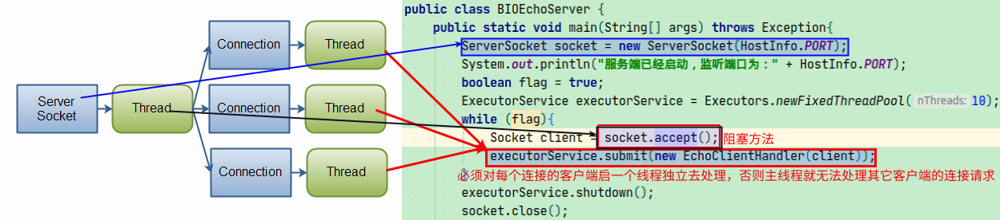
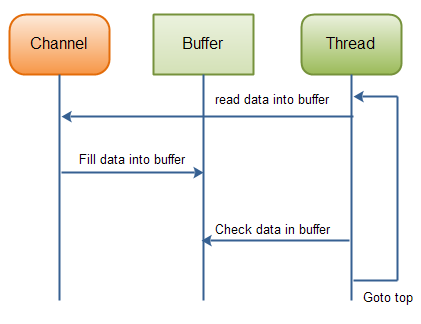

## j2ee：
-   集合
    -   接口架构
        -   Collection{List(ArrayList、LinkedList)、Set(HashSet、TreeSet)}
    
        -   Map{HashMap、TreeMap}
        
    -   源码分析
        -   ArrayList 源码解析：
            首次添加元素时，通过grow方法初始化默认容量为10的数组elementData[10];
            后面每次超出容量后就会通过grow方法获取扩容的增量值（原容器值右移一位）
            最终的值不大大于Integer.MAX_VALUE - 8;
        
        -   LinkedList 源码解析：
            使用Node代表一个节点;
            第一次添加元素时，把开始节点和最后节点都指向添加元素所包装的节点对象;
            非第一次添加时，把原最后节点作为添加元素所包装节点的前一个节点元素，而原节点的下一个节点指向刚添加包装后的节点即可。
    
        -   HashMap 源码解析：
            哈希表 + 双向链表结构组成
            
            哈希表的初始容量为16，扩容容量=2^n
            
            何时被扩容？
            当使用的容量=16×0.75 = 12时，扩容
            
            插入的值都是怎么被分配到对应的哈希表各个索引位置的？
            
            对key计算hashcode值，并根据计算出的哈希编码值与其高16取逻辑异或得出hash值(32位二进制数)。
            
            (哈希表长度-1)&上面计算出hash值，就可以得出数据存放的下标位置。
            
            判断对应下标位置是否存放数据？
            如，没，则直接存放;
            存放的是红黑树结构的数据，则插入的树形结构中;
            其它全部是链表结构的数据，
                判断是否有key重复的？
                    有，覆盖原value
                    否，直接存放在链表结构中。
                        还要判断存放后链表长度是否大于8？
                            大于8, 转为红黑树结构;
                            
            注意：
                1）转为红黑树结构存储有个前提条件是，哈希表的容量最小为64。
                2）如果从红黑树结构上移除节点时，还要判断移除后节点数量？
                    如，小于6，则转为链表结构;

-   IO：bio(流)、nio(channel通讯)、aio(nio2)[基于事件和回调机制]
    -   BIO(block I/O)
    
        

        
    
    -   NIO(new I/O)
    
        
        
    -   AIO()    

参考地址：   
1、（线程）https://blog.csdn.net/u012250875/article/details/78341874
2、（NIO）https://blog.csdn.net/f191501223/article/details/86565432
3、（NIO）https://blog.csdn.net/Oeljeklaus/article/details/87892610

    
JUC：线程、锁、线程池、executor
    1）创建线程：
        extends Thread
        implements Runnable
    2）start与run方法
        start通知线程组线程启动
        run线程执行体
    3）Runnable与Callable
        Runnable.run 无返回值
        Callable 有返回值，可以获取异步执行的结果
    4）volatile、synchronized
        volatile：保证多线程之间的可见性
        synchronized：对象锁（this）、类锁（静态方法对应的class）
    5）线程安全
    6）线程之间如何共享数据
        阻塞队列BlockingQueue
    7）sleep与wait区别
        sleep线程停止但不释放所持有的锁
        waite线程停止并释放锁和notify和notifyAll结合使用，用来通知其他等待的线程
    8）ThreadLocal有什么用
        以空间换时间，每个线程都维护一个ThreadLocalMap
    9）生产者消费者模型
        平衡生产能力和消费能力来保证整个系统的运行效率
        解偶：减少了生产者和消费者之间的联系
    10）为什么wait()方法和notify()/notifyAll()方法要在同步块中被调用
        JDK强制的，调用之前必须先获取锁。
    11）wait()方法和notify()/notifyAll()方法在放弃对象监视器时有什么区别
        wait会立即释放;
        notify()/notifyAll()等待线程剩余代码执行完后释放。
    12）为什么要用线程池
        避免频繁地创建和销毁线程，达到线程对象的重用。
    13）线程的五种状态
        新生状态(new)、就绪状态(start)、运行状态(run)、阻塞状态（等待阻塞[wait]、同步阻塞[synchronized]、其他阻塞）、死亡状态
    14）AQS（AbstractQueuedSynchronizer）
    15）   
        

## 23种设计模式：
单例模式：懒汉式（线程安全）、饿汉式（非线程安全）
工厂模式：简单工厂、工厂方法
模板方法：RestTemplate，...
建造者模式（Builder Pattern）：SqlSessionFactoryBuilder、...
代理默认（Proxy Pattern）：
适配器模式（Adapter Pattern）：springMVC，request--->DispatchServlet-->HandlerMapper(URL<->Controller)-->HandlerAdapter(URL<->Controller.handleMethod)-->ViewReslover-->ModelAndView
门面模式（Facade Pattern）：
观察者模式（Observer Pattern）：
策略模式（Strategy Pattern）：

## 数据库问题：
1、事务的基本要素（ACID）

2、事务的隔离级别（read-uncommitted/read-committed/repeatable-read/serializable）[行级锁、表级锁]

3、索引    
    索引原理（有序表，快速查询，减少磁盘IO）   
    少建索引：表记录少/经常插入、删除、修改的表/数据重复且分布均匀的表字段
    聚合索引：最左前缀原则
    
  3.1、索引分类  
    （索引 聚集索引 唯一索引 普通索引 联合索引 覆盖索引）
    主键索引（表只有一个唯一主键） 
    普通索引（无任何限制） 
    唯一索引（表字段值唯一性）   
    联合索引（多个字段）  
    覆盖索引 ？
    全文索引（查找文本中的关键字段）
    
4、表分区   
    将数据库一张表分解成多个更小的，从逻辑上看，只有一张表，但底层却是由多个物理分区组成。

5、分区与分表区别   
    分表，将一张表按照一定规律分成多张表;     
    分区，从逻辑上看只有一张表;

6、表分区好处     
    优化查询，where语句包含分区条件;
    
7、乐观锁与悲观锁   
    乐观锁：每次拿数据不会被修改，多读，提高并发速度，只需更新时验证是否被修改即可;    
    悲观锁：每次拿数据都会被修改，用行锁/表锁来保证;   

8、MySQL优化   
    1）开启查询缓存    
    2）explain select查询分析查询语句    
    3）只要查询一行时使用limit 1，MySQL找到后就停止查找;   
    4）为搜索字段建立索引;     
    5）选择正确的存储引擎; InnoDB(锁)\MyISAM(非事务性锁)

注意：mysql 聚合函数、单行函数、分组函数使用规则

## spring、springboot

## springcloud、dubbo

-   微服务优缺点
    -   优点
        每个服务足够内聚，足够小，代码足够小容易聚集一个指定业务
        容易灵活部署，应用docker容器化
        
    -   缺点
        开发人员要处理分布式系统的复杂度
        多服务带来运维难度
        系统部署依赖
        数据一致性

    

## 中间件
-   Redis
    -   数据类型：
        string、hash(对象)、list(有序)、set(无序不重复)、sorted set(有序不重复)
        
    -   redis持久化？持久化方式？
        持久化-把内存写入磁盘
        RDB（Redis DataBase）、AOF（Append-only file）

    -   redis架构模式        
        1）单机模式
        2）主从复制
        3）哨兵
        4）集群
        
    -   缓存穿透？缓存雪崩？
        缓存穿透-大量由于key对应的缓存数据不存在，而频繁查询DB库，造成对系统的访问压力。解决方法：通过bitmap过滤。
        缓存雪崩-缓存服务器重启或大量缓存集中在某一时间段失效，这样的失效给后台带来大压力，导致系统崩溃。

    -   参考地址：https://www.cnblogs.com/jasontec/p/9699242.html
        
-   Zookeeper
    -   是什么？
        分布式协调/通知、命名服务，保证CAP理论中的CP。
        
    -   提供了什么？
        文件系统、通知机制
        
    -   四种类型的数据节点Znode
        持久节点、持久顺序节点
        临时节点、临时顺序节点
    -   参考地址：https://www.cnblogs.com/lanqiu5ge/p/9405601.html    
    
-   kafka
    -   是什么？
        分布式发布-订阅消息系统
    
    -   参考地址：https://blog.csdn.net/qq_28900249/article/details/90346599        
                  
            

